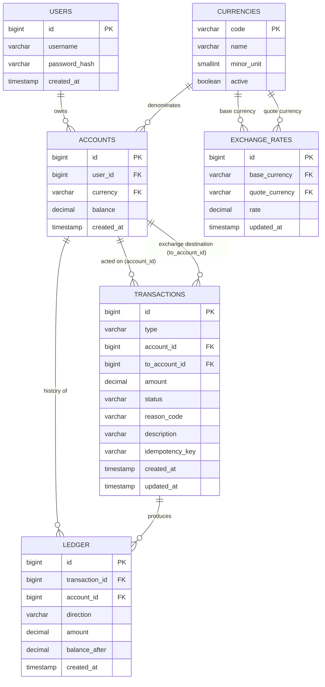

# Technical Design — Donut Bank

## 1. Data Schema

All money columns are `DECIMAL(19,4)` / `BigDecimal` in code — never `float`/`double`.

### 1.1 `users`

Authentication decision: JWT over server-side sessions: simpler for a stateless microservice, no session storage to manage.

| Column | Type | Notes |
|---|---|---|
| id | BIGINT PK | |
| username | VARCHAR(64) UNIQUE | |
| password_hash | VARCHAR(255) | BCrypt |
| created_at | TIMESTAMP | |

### 1.2 `currencies`

| Column | Type | Notes |
|---|---|---|
| code | VARCHAR(3) PK | ISO 4217, e.g. `EUR` |
| name | VARCHAR(64) | |
| minor_unit | SMALLINT | decimal places for display/rounding (2 for EUR/USD, 0 for VND) |
| active | BOOLEAN | soft-disable instead of deleting a code that historical rows still reference |

Seeded at startup;

### 1.3 `accounts`

| Column | Type | Notes |
|---|---|---|
| id | BIGINT PK | |
| user_id | BIGINT FK → users.id | |
| currency | VARCHAR(3) FK → currencies.code | |
| balance | DECIMAL(19,4) | never negative once committed; mutated only under a row lock — see [§3](#3-security-risk-checklist) |
| created_at | TIMESTAMP | |

A user may have multiple accounts in the same currency.

### 1.4 `transactions` — the request/attempt

Tracks the lifecycle of one *attempt* to move money, independent of whether it actually succeeded.

| Column | Type | Notes |
|---|---|---|
| id | BIGINT PK | used in `/api/transactions/{id}` |
| type | VARCHAR(16) | `CREDIT`, `DEBIT`, `EXCHANGE` |
| account_id | BIGINT FK → accounts.id | for `CREDIT`/`DEBIT`, the account acted on; for `EXCHANGE`, the source account |
| to_account_id | BIGINT NULL FK → accounts.id | only set for `EXCHANGE` — the destination account |
| amount | DECIMAL(19,4) | always positive; for `EXCHANGE` this is the source-currency amount |
| status | VARCHAR(16) | `PENDING` → `COMPLETED` \| `FAILED` \| `REJECTED` (terminal) |
| reason_code | VARCHAR(32) NULL | set when `FAILED`/`REJECTED`, e.g. `insufficient_funds`, `external_call_timeout` |
| description | VARCHAR(255) | |
| idempotency_key | VARCHAR(64) UNIQUE NULL | see [§2](#2-api-conventions) |
| created_at | TIMESTAMP | when the attempt was first recorded |
| updated_at | TIMESTAMP | when `status` last transitioned |

`status` is the one field allowed to transition (`PENDING` → a terminal state). 
Decision: no `currency` column: an account's currency is immutable, so it's always derivable from `account_id`/`to_account_id`.

### 1.5 `ledger` — the confirmed money movement

Append-only, immutable. A row is written **only** when a `transactions` row reaches `COMPLETED` — `PENDING`/`FAILED`/`REJECTED` attempts never produce a ledger row. Summing this table's signed entries for an account should always equal its current balance.

| Column | Type | Notes |
|---|---|---|
| id | BIGINT PK | |
| transaction_id | BIGINT FK → transactions.id | indexed; for `EXCHANGE`, both of its ledger rows share this same value |
| account_id | BIGINT FK → accounts.id | drives per-account history queries |
| direction | VARCHAR(8) | `CREDIT`/`DEBIT` — whether this entry increased or decreased the account's balance, the only thing needed to compute `balance_after` |
| amount | DECIMAL(19,4) | always positive |
| balance_after | DECIMAL(19,4) | |
| created_at | TIMESTAMP | the completion time; indexed, drives pagination/sort and the chart's time axis |

A `CREDIT`/`DEBIT` transaction produces exactly one ledger row; an `EXCHANGE` produces exactly two (`direction=DEBIT` on the source account, `direction=CREDIT` on the destination account), both pointing at the same `transaction_id`. Whether a given `CREDIT`/`DEBIT` ledger row is a plain movement or one leg of an exchange is read off the parent `transactions.type` via the join — not duplicated here.

### 1.6 `exchange_rates`

| Column | Type | Notes |
|---|---|---|
| id | BIGINT PK | |
| base_currency | VARCHAR(3) FK → currencies.code | |
| quote_currency | VARCHAR(3) FK → currencies.code | |
| rate | DECIMAL(19,8) | `1 base = rate * quote` |
| updated_at | TIMESTAMP | |

Seeded at startup;

## 2. API Conventions

The full contract — paths, methods, request/response schemas — lives in [openapi.yaml](openapi.yaml). 

- **Errors vs. business outcomes.** [RFC 7807 Problem Details](https://www.rfc-editor.org/rfc/rfc7807) (`type`, `title`, `status`, `detail`, `instance`) covers the *request* being invalid — i.e. bad auth, not-your-account, malformed body, validation failure. A well-formed credit/debit/exchange request always gets `200`/`201` plus the resulting `transactions` row in the body.
- **Authorization scoping.** Every account/transaction lookup is scoped to the authenticated principal at the query level (`findByIdAndUserId`), not a post-hoc controller check.
- **Idempotency.** `/credits`, `/debits`, `/exchanges` all require an `Idempotency-Key` header, stored as `transactions.idempotency_key` ([§1.4](#14-transactions--the-requestattempt)) under a `UNIQUE` constraint. De-duplication relies on that constraint rejecting the second insert, not on a prior existence check — a check-then-insert would race when two requests with the same key arrive concurrently. On conflict, the handler returns the original request's `transactions` row instead of erroring.

## 3. Security Risk Checklist

Most mitigations are explained in full where the mechanism actually lives (schema notes, §2); this table is a scan-friendly list of what's been considered, pointing back rather than repeating.

| Risk | Mitigation |
|---|---|
| **IDOR** — account A's owner guessing account B's id and reading/debiting it | Query-level scoping (§2). Not-found-or-not-owned both return a generic 404, so there's no existence leak via response code. |
| **Spoofable identity** if a `X-User-Id` header were used instead of real auth | Real JWT auth, not a client-supplied header — see [§1.1](#11-users). |
| **Double-spend / race condition** on concurrent debits overdrawing an account | Pessimistic row locking — see [§1.3](#13-accounts). On insufficient funds, no `ledger` row is written; the `transactions` row is marked `REJECTED` instead — see [§1.4](#14-transactions--the-requestattempt). |
| **Duplicate processing on retry** (e.g., client retries a debit after a timeout, or two concurrent requests share a key) | Mandatory `Idempotency-Key` enforced via a DB-level `UNIQUE` constraint — see [§2](#2-api-conventions). |
| **External-call dependency (httpstat.us simulation) blocking or hanging debits** | The external call happens before the row lock is acquired, not inside it — a slow/hanging call delays only that one request, not every other request against the account. A `DEBIT` is `PENDING` until the call returns; success → `COMPLETED` with a `ledger` row written, timeout/error → `FAILED` with `reason_code=external_call_timeout` and no `ledger` row — money never moves on an unconfirmed call. |
| **Negative or non-finite amounts, currency mismatch** | Bean validation (`@DecimalMin`, scale check) plus a server-side check that the operation's currency equals the account's currency — enforced regardless of what the client sends. |
| **Mass assignment** (client setting `id`, `balance`, `userId`, `createdAt` on create) | Dedicated request DTOs per endpoint exposing only the fields in §2 — never bind directly to JPA entities. |
| **SQL injection** | Spring Data JPA derived/`@Query` methods with bound parameters only; no string-concatenated JPQL/native SQL. |
| **Secrets in a public repo** (assignment requires the code be public) | DB credentials, JWT signing secret, etc. via environment variables / `application-local.properties` excluded by `.gitignore` — never committed. |
| **CORS** | Allow-list exactly the Angular dev/deploy origin; no `*`. |
| **PDF report injection** if transaction `description` is attacker-controlled and rendered into the PDF | Treat `description` as untrusted text — escape/sanitize before passing to the PDF templating engine, regardless of the HTML/PDF library chosen later. |
| **Audit trail tampering** | `ledger` is fully insert-only (§1.5). |
| **Brute-force on `/api/auth/login`** | Rate-limit / lockout after repeated failures. |
